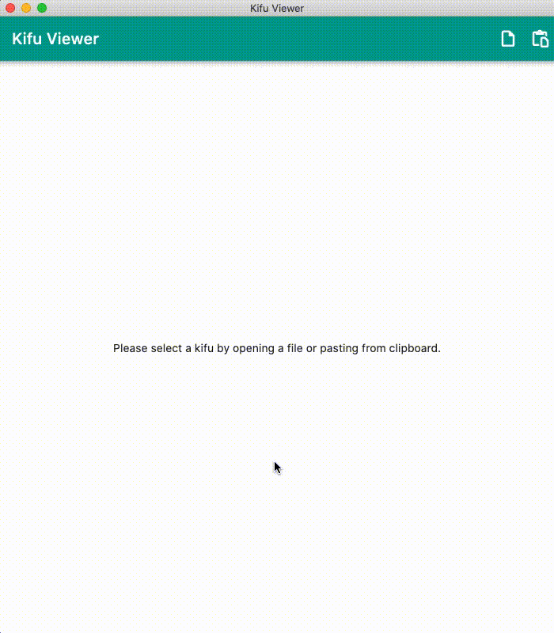

# Kifu Viewer

Shogi (将棋) is a two-player strategy board game native to Japan, belonging to the same family as chess and xiangqi. Kifu (棋譜) is the Japanese term for abstract strategy game record.

Kifu Viewer is a desktop application which allows the loading of `kif` files and viewing shogi games. **This application does not feature a shogi engine, thus the user cannot analyze games nor play against the computer.**

## How to Use

A `kif` file can be loaded by either opening a file or pasting from system clipboard. Both these actions can be achieved via the menu bar, shortcuts or via buttons in the upper-right corner of the application.

Once a kif file is loaded, moves can be stepped through using the arrow keys:

| Key   | Action               |
|-------|----------------------|
| UP    | To the initial board |
| LEFT  | Back one move        |
| RIGHT | Forward one move     |
| DOWN  | To the final board   |



## Download

Please see [https://github.com/defuncart/kifu_viewer/releases](https://github.com/defuncart/kifu_viewer/releases) for the latest release.

For Windows, note that C++ redistributable is required to run the app.

## Getting Started

If you would like to build the app yourself, then you simply need:

- Flutter dev >= 1.23
- Dart >= 2.11
- macOS:
    - Xcode >= 12.3
    - CocoaPods >= 1.10.0
- windows:
    - Developer Mode enabled
- linux:
    - clang
    - ninja-build
    - libgtk-3-dev
    - libblkid-dev
- web:
    - Chrome

To generate `NotoSansJP-RegularLite.otf`, ensure that `pyftsubset` is installed and that a copy of `NotoSansJP-Regular.otf` resides in `assets_dev/fonts/`. Then run the following command:

```
pyftsubset assets_dev/fonts/NotoSansJP-Regular.otf --output-file=assets/fonts/NotoSansJP-RegularLite.otf --unicodes-file=assets_dev/fonts/lite_unicode.txt
```

## Raising Issues and Contributing

Please report bugs and issues, and raise feature requests [here](https://github.com/defuncart/kifu_viewer/issues).

To contribute, submit a PR with a detailed description and tests, if applicable.
